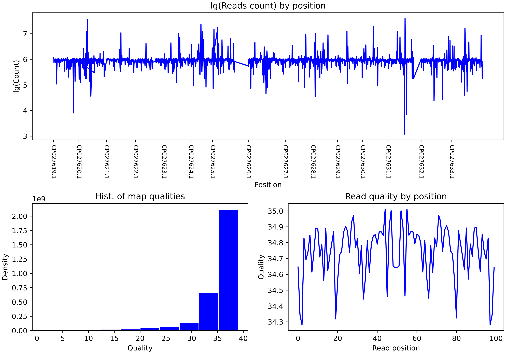

BAM
===

.. currentmodule:: bsxplorer

^^^^^^^^^
Reference
^^^^^^^^^

.. autosummary::
    :toctree: _BAM
    :nosignatures:
    :template: class_with_init.rst

    BAMReader
    PivotRegion

^^^^^
Usage
^^^^^

BSXplorer offers :class:`BAMReader` to convert BAM files into methylation
reports or calculate such methylation statistics as methylation entropy [1],
epipolymorphism [2] or PDR [3].

.. note::
    Input BAM file must be **sorted** and have index .bai file.

-----------
Report mode
-----------

For reading BAM files and converting them into methylation report format
set :class:`BAMReader` use :func:`BAMReader.report_iter`. This method returns
iterator over BAM file and yields data batches in :class:`UniversalBatch` format.

.. code-block:: python

    import bsxplorer as bsx

    reader = bsx.BAMReader(
        bam_filename="path/to/bamfile.bam",
        index_filename="path/to/bamfile.bam.bai",
    )

    # Simple iteration over BAM file
    for batch in reader.report_iter():
        do_something(batch)

    # Batch can be saved into file
    with bsx.UniversalWriter("path/to/output.txt", report_type="bismark") as writer:
        for batch in reader.report_iter():
            writer.write(batch)

For full cytosine methylation report output, cytosine data file needs to be
prepared with :func:`SequenceFile.preprocess_cytosines`. Path to prepocessed
cytosine file should be specified with `cytosine_file` parameter in
:class:`BAMReader` constructor.

.. code-block:: python

    cytosine_filepath = "path/to/cytosines.parquet"
    bsx.SequenceFile("path/to/sequence.fasta").preprocess_cytosines(cytosine_filepath)

    reader = bsx.BAMReader(
        bam_filename="path/to/bamfile.bam",
        index_filename="path/to/bamfile.bam.bai",
        cytosine_file=cytosine_filepath
    )

If there is no need to analyze full BAM file, but only some genomic regions,
user can specify the `regions` parameter in :class:`BAMReader` constructor
with DataFrame generated with :class:`Genome` methods.

.. code-block:: python

    regions = bsx.Genome.from_gff("path/to/annot.gff").gene_body(min_length=2000)

    reader = bsx.BAMReader(
        bam_filename="path/to/bamfile.bam",
        index_filename="path/to/bamfile.bam.bai",
        regions=regions
    )

    for batch in reader:
        # The reader will return batch for each region individually
        ...
.. note::
    If genomic regions in annotation file overlap, resulting batch data will be
    duplicated.

For QC calculation, set qc parameter to True. After reading BAM file QC stats
can be plotted with :func:`BAMReader.plot_qc` method.

Resulting image:

----------
Stats mode
----------

In "stats" mode :class:`BSXplorer` can calculate such methylation statistics
as:

*   Methylation entropy [1]_ which is calculated as the entropy of epialleles
    originating from a single genomic locus.

    .. math::
        ME = \frac{1}{L}\sum_i{-\frac{n_i}{N}\cdot Log\frac{n_i}{N}}

    :math:`L` – window length, :math:`n_i` – number of pattern occurencies in
    window, :math:`N` – total number of different methylation patterns in window.

*   Epipolymorphism [2]_ also captures the amount of heterogeneity of DNA methylation.

    .. math::
        EPM = 1 - \sum_i{(\frac{n_i}{N})^2}

    :math:`n_i` – number of pattern occurencies in window, :math:`N` – total number
    of different methylation patterns in window.

*   PDR (Proportion of discordant reads) [3]_ – a fraction of reads carrying
    cytosines in discordant methylation states (i.e. containing both methylated and
    unmethylated cytosines in a single read) with respect to all reads
    mapped to a cytosines.

    .. math::
        PDR = \frac{d}{c+d}

    :math:`d` – number of discordant reads, :math:`c` – number of concordant reads.

To calculate these methylation statistics, method :func:`BAMReader.stats_iter` need to be
called to get the iterator. Iterator returns :class:`PivotRegion`. Methods
:func:`PivotRegion.methylation_entropy`, :func:`PivotRegion.epipolymorphism` and
:func:`PivotRegion.PDR` can be called to get ME, EPM and PDR values. See documentation
for detailed explanation of these methods.

Example for ME:

.. code-block:: python

    reader = bsx.BAMReader(
            bam_filename="path/to/bamfile.bam",
            index_filename="path/to/bamfile.bam.bai",
        )

    for batch in reader.stats_iter():
        positions, value = batch.methylation_entropy()

.. [1] Xie, H., Wang, M., de Andrade, A., Bonaldo, M.deF., Galat, V., Arndt,
       K., Rajaram, V., Goldman, S., Tomita, T., & Soares, M. B. (2011).
       Genome-wide quantitative assessment of variation in DNA methylation patterns.
       Nucleic acids research, 39(10), 4099–4108. https://doi.org/10.1093/nar/gkr017

.. [2] Landan, G., Cohen, N. M., Mukamel, Z., Bar, A., Molchadsky, A., Brosh,
       R., Horn-Saban, S., Zalcenstein, D. A., Goldfinger, N., Zundelevich,
       A., Gal-Yam, E. N., Rotter, V., & Tanay, A. (2012).
       Epigenetic polymorphism and the stochastic formation of differentially
       methylated regions in normal and cancerous tissues. Nature genetics,
       44(11), 1207–1214. https://doi.org/10.1038/ng.2442

.. [3] Lee D, Koo B, Yang J, Kim S (2023)
       Metheor: Ultrafast DNA methylation heterogeneity calculation from bisulfite
       read alignments. PLoS Comput Biol 19(3): e1010946.
       https://doi.org/10.1371/journal.pcbi.1010946