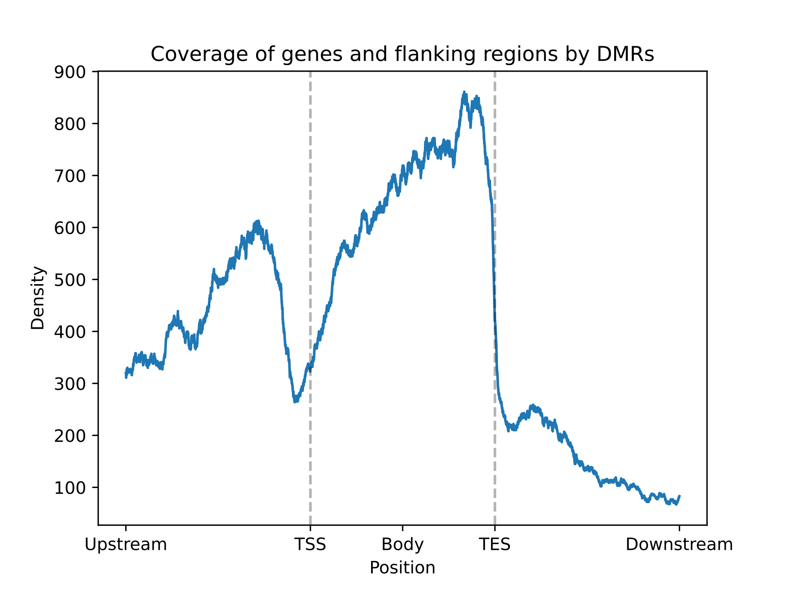

Genome
======

^^^^^^^^^
Reference
^^^^^^^^^

.. currentmodule:: bsxplorer

.. autosummary::
    :nosignatures:
    :toctree: _Genome
    :template: class.rst

    Genome
    Enrichment
    EnrichmentResult

^^^^^
Usage
^^^^^

BSXplorer offers functionality to align one set of regions over another. Regions can
be read either with :class:`Genome` or initialized directly with
`polars functionality <https://docs.pola.rs/api/python/stable/reference/api/polars.read_csv.html>`_
(DataFrame need to have `chr`, `start` and `end` columns).

To align regions (e.g. define DMR position relative to genes) or perform the enrichment of regions at these
genomic features against the genome background use :class:`Enrichment`.

.. code-block:: python

    import bsxplorer as bsx

    # If you want to perform an ENRICHMENT, and not only plot
    # the density of metagene coverage, you NEED to use .raw() method
    # for genome DataFrame.
    genes = bsx.Genome.from_gff("path/to/annot.gff").raw()
    dmr = bsx.Genome.from_custom(
        "path/to/dmr.txt",
        chr_col=0,
        start_col=1,
        end_col=2
    ).all()

    enrichment = Enrichment(dmr, genes, flank_length=2000).enrich()

:func:`Enrichment.enrich` returns :class:`EnrichmentResult`, which stores enrichment
statistics and coordinates of regions which have aligned with
genomic features. The metagene coverage with regions
can be plotted via :func:`EnrichmentResult.plot_density_mpl` method.

.. code-block:: python

    fig = res.plot_density_mpl(
        flank_windows=100,
        body_windows=200,
        major_labels=["TSS", "TES"],
        minor_labels=["-2000bp", "Gene body", "+2000bp"]
    )

Example of resulting image:

Enrichment statistics can be accessed with :attr:`EnrichmentResult.enrich_stats`
or plotted with :func:`EnrichmentResult.plot_enrich_mpl`