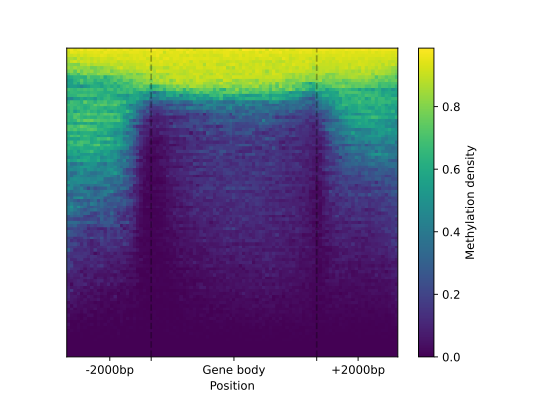
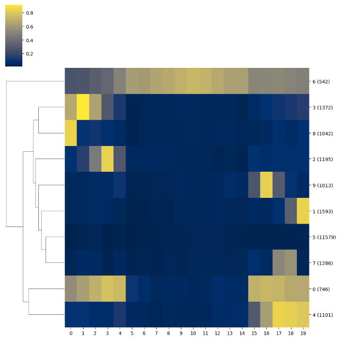

# I. EDA of BSSeq data generated from non-model organism

BSXplorer is a tool that is specifically designed for easy EDA and visualization of bisulfite sequencing data. 
It is particularly useful for non-model organisms such as commercially valuable crops and plants, 
where often there is no reference database available. 
Researchers in such cases may only have access to an assembled genome and partially or 
spuriously assembled CDS from publications and associated genomic projects. 
To demonstrate its capabilities, we will use Brassica rapa subsp. perviridis WGBS dataset **[1]** as an example.

- [**Metagene analysis**](eda1.Metagene_analysis)
- [**Chromosome methylation levels analysis**](eda1.ChrLevels_analysis)
- [**Genes to TE comparison**](eda1.TE_analysis)

**[1]** _Tirnaz S, Miyaji N, Takuno S, Bayer PE, Shimizu M, Akter MstA, et al. Whole-Genome DNA Methylation Analysis in 
Brassica rapa subsp. perviridis in Response to Albugo candida Infection. Front Plant Sci. 2022;13:849358._

(eda1.Metagene_analysis)=
## Metagene analysis

### Read reports

```python
import bsxplorer
```

The analysis begins with the initialization of the [**`Genome`**](bsxplorer.Genome) object, 
which stores information about the annotation of genomic regions and their coordinates.

```python
genome = bsxplorer.Genome.from_custom(
    "genomic_id_ncbi.tsv",
    chr_col=0, type_col=1, start_col=2, end_col=3, strand_col=4, id_col=5, has_header=True
).gene_body(min_length=0, flank_length=2000)
```

The [**`Metagene`**](bsxplorer.Metagene) object is initialized with the dedicated constructor as shown below:

```python
metagene = bsxplorer.Metagene.from_bismark(
    "DRR336466.CX_report.txt.gz", genome, 
    up_windows=250, body_windows=500, down_windows=250
)
```

### Visualize

To generate a simple line plot to visualize DNA methylation patterns in gene regions the 
Metagene’s  [**`.line_plot()`**](bsxplorer.Metagene.line_plot) is applied. 
Then to render the figure the [**`.draw_mpl()`**](bsxplorer.LinePlot.draw_mpl) method of is used.

```python
tick_args = dict(
    major_labels=["", ""], 
    minor_labels=["-2000bp", "Gene body", "+2000bp"]
)

metagene.line_plot(stat="mean").draw_mpl(confidence=.99, **tick_args)
```

{.doc-single-image}

The metagene object to [can be subsetted by methylation context and strand](bsxplorer.Metagene.filter) to make a 
customized heatmap representation (with a [**`.heat_map()`**](bsxplorer.Metagene.heat_map) function) 
of methylation pattern in/around gene regions.

```python
filtered = metagene.filter(context="CG", strand="-")
filtered.heat_map(ncol=100, nrow=100).draw_mpl(
    major_labels=["", ""], 
    minor_labels=["-2000bp", "Gene body", "+2000bp"]
)
```

{.doc-single-image}

In cases where a heatmap is too cluttered, [clustering genes](bsxplorer.Metagene.cluster) can generate a clearer representation of the heatmap.

```python
kmeans = filtered.resize(20).cluster(count_threshold=5, na_rm=0).kmeans(n_clusters=10)
kmeans.draw_mpl()
```

{.doc-single-image}

To facilitate further exploration of the data via, for instance, functional enrichment analyses the tab-delimited list 
of regions and the associated module IDs can be exported to a file, as shown below:

```python
kmeans.save_tsv("kmeans_labels.tsv")
```

(eda1.ChrLevels_analysis)=
## Chromosome methylation levels analysis

BSXplorer allows a user to visualize the overall methylation levels of chromosomes using the corresponding 
[**`ChrLevels`**](bsxplorer.ChrLevels) object:

```python
levels = bsxplorer.ChrLevels.from_bismark("DRR336466.CX_report.txt.gz", chr_min_length=10**6, window_length=10**6)
levels.draw_mpl(smooth=5)
```

{.doc-single-image}

In a way that is [similar to the Metagene method](bsxplorer.ChrLevels.filter), the methylation data 
can be subjected to filtering to selectively display a methylation context that is of interest.

```python
levels.filter(context="CG").draw_mpl(smooth=5)
```

{.doc-single-image}

(eda1.TE_analysis)=
## Genes to TE comparison

BSXplorer is a tool that provides various capabilities for the analysis, comparison, 
and visualization of methylation profiles for different samples and genomic elements. 
For instance, it can compare methylation patterns of genes and transposable elements in Brassica rapa subsp. perviridis.

```python
annotation = bsxplorer.Genome.from_custom(
    "genomic_id_ncbi.tsv",
    chr_col=0, type_col=1, start_col=2, end_col=3, strand_col=4, id_col=5,    has_header=True
)

genes = annotation.gene_body(min_length=0, flank_length=500)
te = bsxplorer.Genome.from_gff("TE.gff").other("match", 0, flank_length=500)
```

To start the analysis, we first read the annotation and then select genes ([**`.gene_body`**](bsxplorer.Genome.gene_body)) 
and transposable elements ([**`.other(region_type="match")`**](bsxplorer.Genome.other)) for further analysis. 
We then create an object using the MetageneFiles class that stores information about several metagenes.

As shown previously, the object is filtered by DNA strand and methylation context prior to plotting.

```python
filtered = metagenes.filter(context="CG", strand="-")

labels_settings = dict(major_labels=["", ""], minor_labels=["-500bp", "Body", "+500bp"])

filtered.line_plot().draw_mpl(smooth=5, confidence=.95, **labels_settings)
filtered.heat_map(10, 20).draw_mpl(**labels_settings)
```

{.doc-single-image}

{.doc-single-image}

The MetageneFiles object has [**`.box_plot()`**](bsxplorer.MetageneFiles.box_plot) and 
[**`.violin_plot()`**](bsxplorer.MetageneFiles.violun_plot) functions for box plot and violin plot graphs. 
The [**`.trim_flank()`**](bsxplorer.MetageneFiles.trim_flank) method analyzes methylation of the body of the region.

```python
filtered.trim_flank().box_plot()
filtered.trim_flank().violin_plot()
```

{.doc-double-image}
{.doc-double-image}