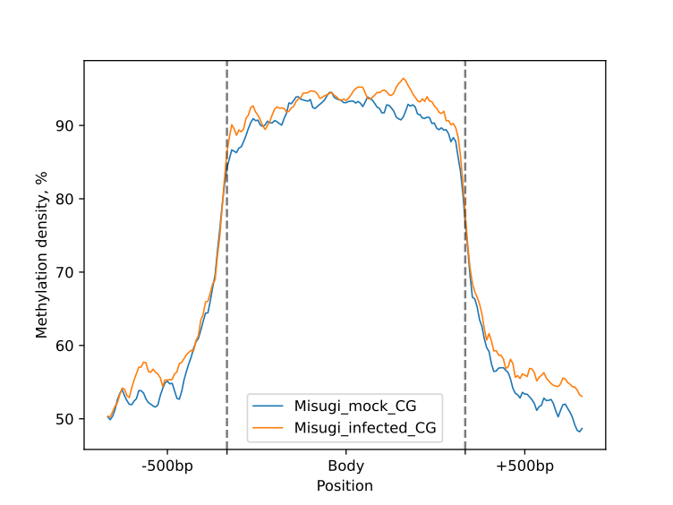
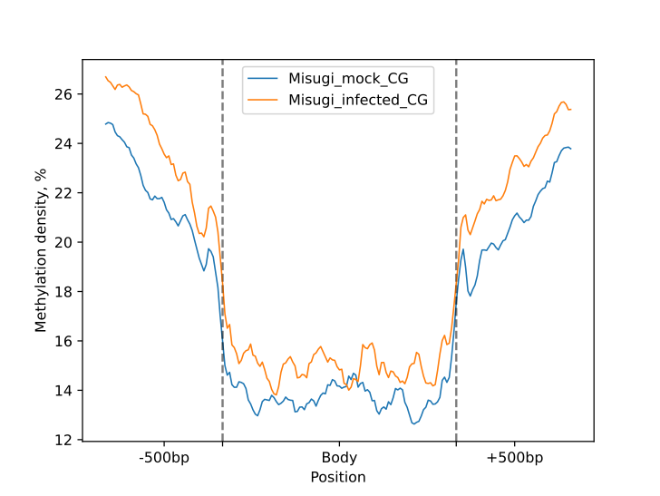
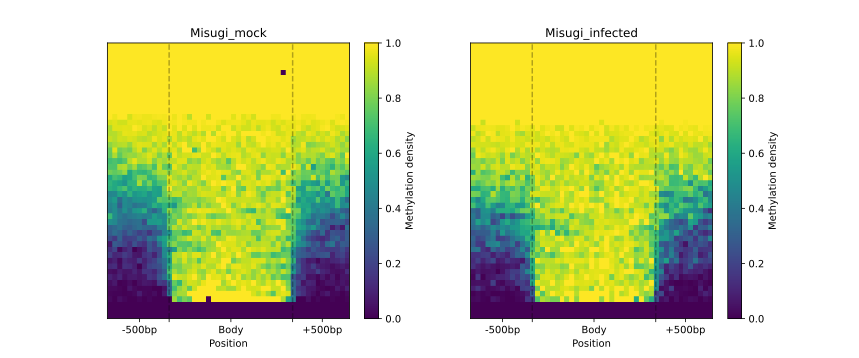
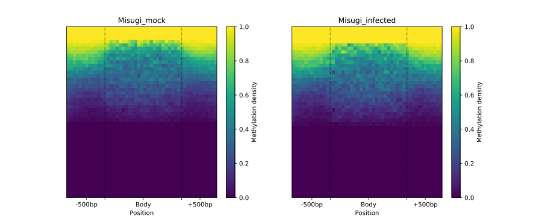
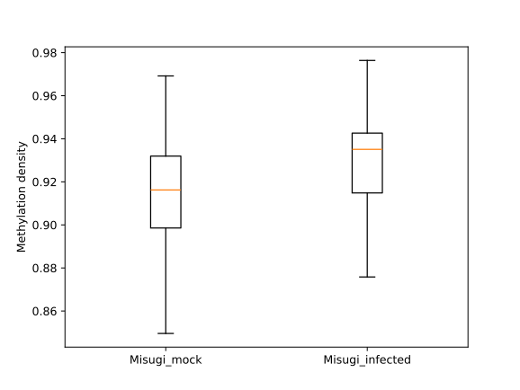
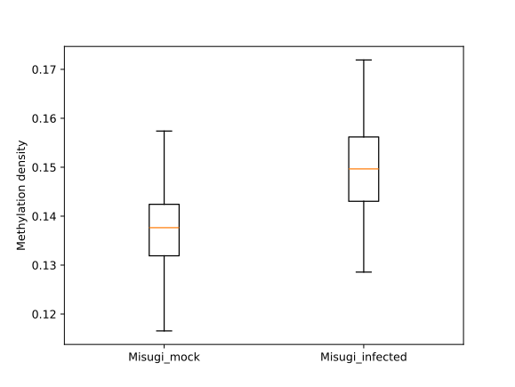
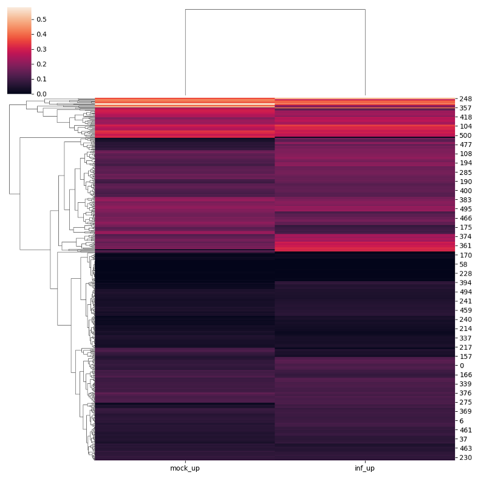
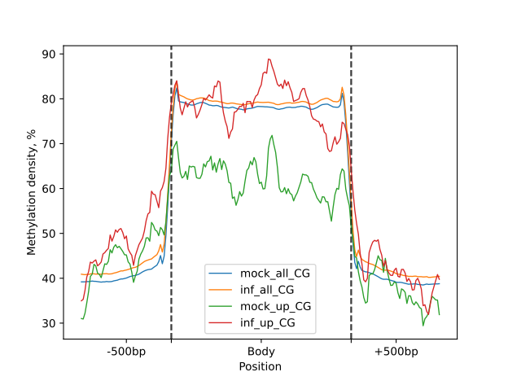
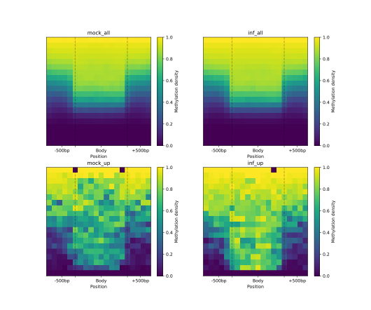
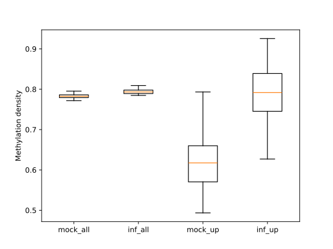

# II. EDA of BSSeq data generated from non-model organism in different conditions

BSXplorer allows for the categorization of regions based on their methylation level and density. 
This is done by assuming that cytosine methylation levels follow a binomial distribution, 
as explained in Takuno and Gaut's research (please refer to **[1, 2]** https://doi.org/10.1073/pnas.1215380110 for details). 
The genes are then divided into three categories, 
BM (body-methylated), IM (intermediately-methylated) and UM (under-methylated), 
based on their methylation levels in the CG context using the following formula.

$$ CG<P_{CG};\ \ CHG/CHH>1-P_{CG} $$

$$ P_{CG}\le CG<1-P_{CG};\ \ CHG/CHH>1-P_{CG} $$

$$ CG/CHG/CHH>1-P_{CG} $$

The same rationale may be applied to other methylation contexts, 
as BSXplorer can produce $P_{CHG}$ and $P_{CHH}$ for CHG sites and CHH sites, respectively. 

**[1]** _Takuno S, Gaut BS. Body-Methylated Genes in Arabidopsis thaliana Are Functionally Important and Evolve Slowly. Mol Biol Evol. 2012;29:219–27._

**[2]** _Takuno S, Gaut BS. Gene body methylation is conserved between plant orthologs and is of evolutionary consequence. Proc Natl Acad Sci. 2013;110:1797–802._

## Categorisation with console script

Firstly, we will demonstrate the categorization of regions and their visualization 
using a console script.

```commandline
bsxplorer-category -o TE_Cat_Report --dir TE_Cat -u 50 -d 50 -b 100 -S 10 --ticks \\-500bp \\ Body \\ \\+500bp -C 0 -V 50 -H 50 -q .75 --save_cat te_conf.tsv
```

A user can obtain a complete list of parameters by using the command bsxplorer-category --help. 
The configuration file has the following structure

_Header should NOT be included in real config file._

| sample group    | Path to report             | Path to genome | Flank length | Minimal length | Region_type |
|-----------------|----------------------------|----------------|--------------|----------------|-------------|
| Misugi_mock     | DRR336466.CX_report.txt.gz | TE.gff         | 500          | 0              | match       |
| Misugi_mock     | DRR336467.CX_report.txt.gz | TE.gff         | 500          | 0              | match       |
| Misugi_infected | DRR336468.CX_report.txt.gz | TE.gff         | 500          | 0              | match       |
| Misugi_infected | DRR336469.CX_report.txt.gz | TE.gff         | 500          | 0              | match       |

The `bsxplorer-category` command imports Bismark's cytosine report file and performs a binomial test 
to determine the statistical significance of methylation at each site. 
The command uses the estimated error rate to conduct the test and generates corresponding p-values, 
which can be exported using the API. Additionally, 
the tool imports genomic annotation for each region in every context and calculates the 
PCG (or $P_{CHG}$ or $P_{CHH}$) value. 
Finally, it filters and classifies the regions into UM, BM and other classes based on the results obtained.

The following plots were generated for the BM and UM regions (CG-context) as part of the HTML-report.

{.doc-double-image}
{.doc-double-image}

{.doc-double-image}
{.doc-double-image}

{.doc-double-image}
{.doc-double-image}

## Categorisation with Python API

The API version of the above command string is presented in the code snippet below:

```python
annot = bsxplorer.Genome.from_gff("TE.gff")
annot = annot.other(region_type="match", flank_length=500, min_length=200)

mock_merged = merge_replicates(
    ["DRR336466.CX_report.txt.gz", "DRR336467.CX_report.txt.gz"],
    report_type="bismark"
)
inf_merged = merge_replicates(
    ["DRR336468.CX_report.txt.gz", "DRR336469.CX_report.txt.gz"],
    report_type="bismark"
)

p_value_kwargs = dict(
    genome=annot,
    methylation_pvalue=.05
)

mock_binom = bsxplorer.BinomialData.from_report(
    mock_merged.name, report_type="parquet", min_coverage=2
)
mock_pstat = mock_binom.region_pvalue(**p_value_kwargs)

inf_binom = bsxplorer.BinomialData.from_report(
    inf_merged.name, report_type="parquet", min_coverage=2
)
inf_pstat = inf_binom.region_pvalue(**p_value_kwargs)

categorise_kwargs = dict(
    context="CG", p_value=.05, min_n=5
)

# Returns tuple with (BM, IM, UM) ids
mock_cat = mock_pstat.categorise(**categorise_kwargs, save="mock")
inf_cat = inf_pstat.categorise(**categorise_kwargs, save="mock")

metagene_kwargs = dict(
    genome=annot,
    up_windows=50, body_windows=100, down_windows=50,
)
mock_metagene = bsxplorer.Metagene.from_binom(mock_binom.path, **metagene_kwargs)
inf_metagene = bsxplorer.Metagene.from_binom(inf_binom.path, **metagene_kwargs)

# e.g. for CG BM
metagenes = bsxplorer.MetageneFiles([
    mock_metagene.filter(context="CG", genome=mock_cat[0]), inf_metagene.filter(context="CG", genome=mock_cat[0])
], ["Mock", "Infected"])

tick_kwargs = dict(
    major_labels=["", ""],
    minor_labels=["-500bp", "Body", "+500bp"]
)

metagenes.line_plot(smooth=10).draw_mpl(**tick_kwargs)
metagenes.heat_map(50, 50).draw_mpl(**tick_kwargs)
```

For detailed explanation of used methods and parameters see:

- [Basic usage tutorial](gs.Basic_usage) 
- [bsxplorer.BinomialData](bsxplorer.BinomialData)
- [bsxplorer.RegionStat](bsxplorer.RegionStat)

## Conditions comparison

Using BSXplorer, the following section displays a practical approach to presenting these elements. 
The control and infected samples are referred to as "mock" and "inf" respectively. 
Here we assume that $P_{CG}$ statistics which enables UM and BM classification has been computed in the previous 
steps of analyses (by `--save_cat` option of `bsxplorer-category` or `save` parameter of [**`RegionStat.categorise()`**](bsxplorer.RegionStat)).

After importing the bisulfite data for the transposons (`Misugi_mockCG_UM.tsv` and `Misugi_infectedCG_BM.tsv`), 
the sets are intersected, matched with the annotation file, 
and the resulting patterns are visualized and compared to other regions.

Here we will use Polars ([https://pola.rs/](https://pola.rs/)) module for DataFrames manipulation.

```python
import polars as pl

# Read mock_UM and inf_BM TE IDs
mock_um = pl.read_csv("Misugi_mockCG_UM.tsv", separator="\t", has_header=False)[:, 3].to_list()
inf_bm = pl.read_csv("Misugi_infectedCG_BM.tsv", separator="\t", has_header=False)[:, 3].to_list()

# Intersect TE IDs from two groups
mock_inf_up = list(set.intersection(set(mock_um), set(inf_bm)))

# Load annotation file
te = bsxplorer.Genome.from_gff("TE.gff").other("match", 0, flank_length=500)
```

The metagenes are constructed using the mean statistics with the `sumfunc="mean"` parameter.

```python
args = dict(genome=te, up_windows=50, body_windows=100, down_windows=50, sumfunc="mean")

# Read replicates metagenes
metagene_mock = bsxplorer.MetageneFiles.from_list(["DRR336466.CX_report.txt.gz", "DRR336467.CX_report.txt.gz"], labels=["mock-1", "mock-2"], **args)
metagene_inf = bsxplorer.MetageneFiles.from_list(["DRR336468.CX_report.txt.gz", "DRR336469.CX_report.txt.gz"], labels=["inf-1", "inf-2"], **args)

# Merge biological replicates
metagene_mock = metagene_mock.merge()
metagene_inf = metagene_inf.merge()
```

The [**`.merge()`**](bsxplorer.MetageneFiles.merge) method of the MetageneFiles class is used to combine biological replicates. 
The following code snippet creates a clustergram for a selected subset of genomic regions of interest using the 
[**`.dendrogram()`**](bsxplorer.MetageneFiles.dendrogram) function.

```python
# Construct a MetageneFiles object to visualize dendrogram
dendro_metagene = bsxplorer.MetageneFiles([metagene_mock.filter(id=mock_inf_up), metagene_inf.filter(id=mock_inf_up)], ["mock_up", "inf_up"])

dendro_metagene.dendrogram(q=0)
```

{.doc-single-image}

To visually compare the UM and BM regions that contain transposable elements with the remaining genomic regions that 
exhibit UM or BM patterns, we create a [**`MetageneFiles`**](bsxplorer.MetageneFiles) object. This object enables us to generate line and box plots, as 
well as heatmaps that display methylation levels in the aforementioned classes.

```python
metagenes = bsxplorer.MetageneFiles(
    [metagene_mock, metagene_inf, metagene_mock.filter(id=mock_inf_up), metagene_inf.filter(id=mock_inf_up)],
    ["mock_all", "inf_all", "mock_up", "inf_up"]
)
filtered = metagenes.filter(context="CG")

ticks = {"major_labels": ["", ""], "minor_labels": ["-500bp", "Body", "+500bp"]}
filtered.line_plot(smooth=10).draw_mpl(**ticks)
filtered.heat_map(20, 20).draw_mpl(**ticks)
filtered.trim_flank().box_plot().draw_plotly()
```

{.doc-single-image}

{.doc-single-image}

{.doc-single-image}
