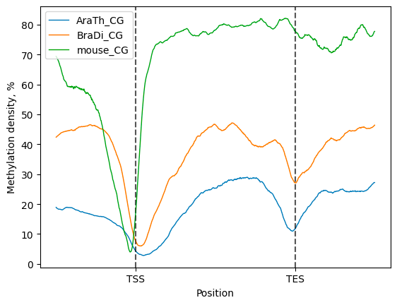
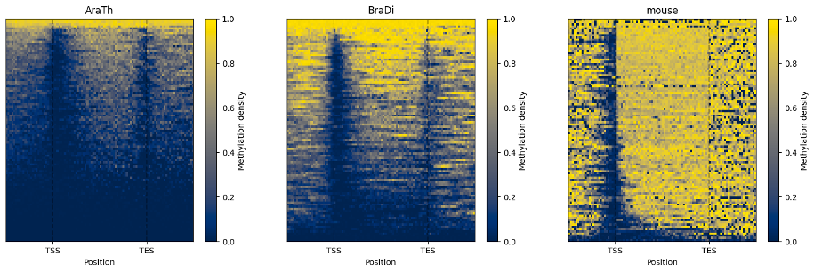
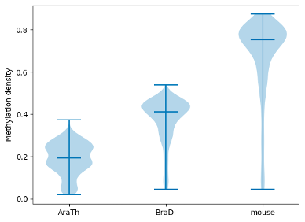
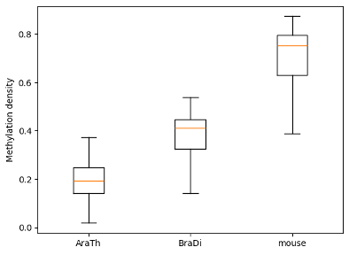

# III. EDA of BSSeq data generated from in different non-model organisms

BSXplorer enables comparison of methylation data across different organisms.

It can be done using:

- [Python API](eda3.pythonapi)
- [Console script](eda3.consolescript)


(eda3.pythonapi)=
## Python API

Start with import of genome annotation data for species of interest.

```python
arath_genes = bsxplorer.Genome.from_gff("arath_genome.gff").gene_body(min_length=0)
bradi_genes = bsxplorer.Genome.from_gff("bradi_genome.gff").gene_body(min_length=0)
mouse_genes = bsxplorer.Genome.from_gff("musmu_genome.gff").gene_body(min_length=0)
```

Next, read in cytosine reports for each sample separately:

```python
window_kwargs = dict(up_windows=200, body_windows=400, down_windows=200)

arath_metagene = bsxplorer.Metagene.from_bismark("arath_example.txt", arath_genes, **window_kwargs)
bradi_metagene = bsxplorer.Metagene.from_bismark("bradi_example.txt", bradi_genes, **window_kwargs)
musmu_metagene = bsxplorer.Metagene.from_bismark("musmu_example.txt", mouse_genes, **window_kwargs)
```

To perform comparative analysis, initialize the [**`bsxplorer.MetageneFiles`**](bsxplorer.MetageneFiles) 
class using metagene data in a vector format, where labels for every organism are provided explicitly.

Next, apply methylation context and strand filters to the input files:

```python
filtered = files.filter("CG", "+")
```

Then, a compendium of line plots to guide a comparative analyses of methylation patterns in 
different species is constructed:

```python
filtered.line_plot(smooth=50).draw_mpl()
```

{.doc-single-image}

The line plot representation may be further supplemented by a heatmap: 

```python
filtered.heat_map(100, 100).draw_mpl()
```

{.doc-single-image}

To examine and highlight differences in methylation patterns between different organisms, summary statistics is made available in a graphical format.

```python
filtered.box_plot(violin=True).draw_mpl()
filtered.box_plot().draw_mpl()
```

{.doc-double-image}
{.doc-double-image}


(eda3.consolescript)=
## Console script

BSXplorer enables comparison of methylation data across different organisms using the console command:

```commandline
bsxplorer-metagene -o IntraMetageneReport --dir IntraMetagene -u 250 -d 250 -b 500 -S 50 --ticks \\-2000bp TSS Body TES \\+2000bp -C 0 -V 100 -H 100 --export pdf intra_conf.tsv
```

A user can obtain a complete list of parameters by using the command bsxplorer-metagene `--help`.
The configuration file has the following structure:

_Header should NOT be included in real config file._

| sample group | Path to report                        | Path to genome                      | Flank length | Minimal length | Region_type |
|--------------|---------------------------------------|-------------------------------------|--------------|----------------|-------------|
| Mus          | SRR16815382_Mus_musculus.CX_report.gz | Mus_musculus_genomic.gff            | 2000         | 0              | gene        |
| Arabidopsis  | A_thaliana.txt                        | A_thaliana_genomic.gff              | 2000         | 0              | gene        |
| Brachipodium | Brachypodium_distachyon_leaf.txt      | Brachypodium_distachyon_genomic.gff | 2000         | 0              | gene        |
| Cucumis      | C_sativus.txt                         | C_sativus_genomic.gff               | 2000         | 0              | gene        |
| Brassica     | DRR336469.CX_report.txt.gz            | genomic.gff                         | 2000         | 0              | gene        |

Below is a list of plots generated for the CG methylation context, as presented in the HTML report file.

{.doc-single-image}

{.doc-single-image}
