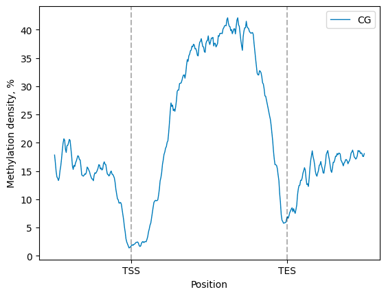
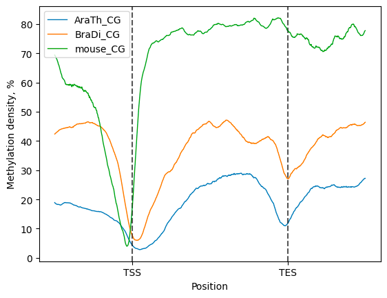
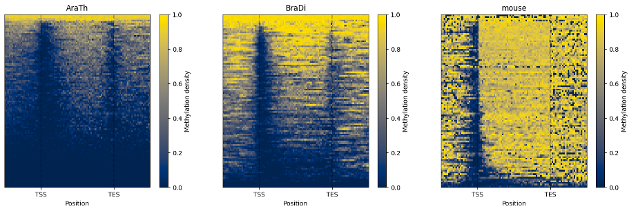
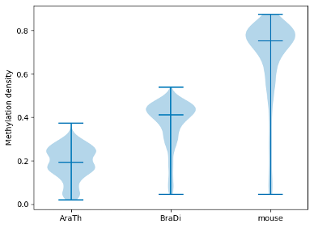
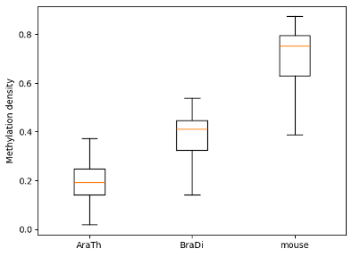
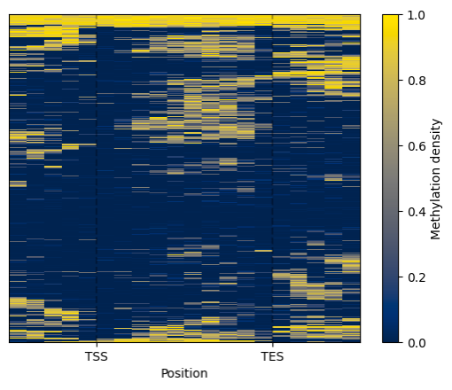
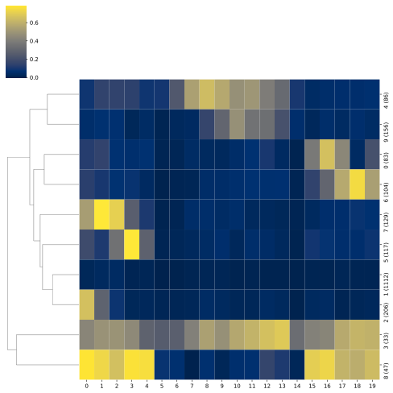

# Getting started

This page will give you the overview of the BSXplorer analysis scenarios.

- [Basic usage](gs.Basic_usage)
- [Contrasting experiments](gs.Contrasting_experiments)
- [Clustering of methylation patterns](gs.Clustering)

(gs.Basic_usage)=
## Basic Usage

The analysis process can be divided into four steps as follows:

1. [Import annotation file](gs.Basic_usage-import)
2. [Read Bismark’s cytosine report file](gs.Basic_usage-read)
3. [Get results](gs.Basic_usage-results)

The example analysis is prepared for Arabidopsis thaliana chromosome 3 (NC_003074.8).
The test data can be downloaded from the [Zenodo repository](https://zenodo.org/records/10137416).

(gs.Basic_usage-import)=
### Import annotation file
Firstly we need to import `bsxplorer` module.

```python
import bsxplorer
```

To import genome annotation from file use BSXplorer function [**`bsxplorer.Genome.from_gff()`**](bsxplorer.Genome.from_gff). 
The parameters provided to the function include a path to the annotation file in GFF format.

```python
genome = bsxplorer.Genome.from_gff("arath_genome.gff")
```

Next, the annotation is filtered to extract the genomic regions of interest. 
E.g. this can be achieved with [**`gene_body()`**](bsxplorer.Genome.gene_body) function from the 
class [**`Genome`**](bsxplorer.Genome), to filter only genes from annotation.

```python
genes = genome.gene_body(flank_length=2000, min_length=3000)
```

Upon completion of these steps, the annotation file can be combined with 
the methylation data from the cytosine report, making it 
possible to perform analyses of DNA methylation patterns within particular genomic contexts.

(gs.Basic_usage-read)=
### Read report

To analyse the cytosine report and carry out metagene analysis, BSXplorer offers the [**`Metagene`**](bsxplorer.Metagene) class. 
In order to read the Bismark’ methylation_extractor output file, the function [**`from_bismark()`**](bsxplorer.Metagene.from_bismark) of the 
[**`Metagene`**](bsxplorer.Metagene) class should be utilised. 

```python
metagene = bsxplorer.Metagene.from_bismark("arath_example.txt", genes, up_windows=100, body_windows=200, down_windows=100)
```

(gs.Basic_usage-results)=
### Get results

Depending on the analyses goals it may be required 
to filter the cytosine report file to extract information on the methylation context of interest 
as well as on strand attribution of a methylation event. 
This is achieved by using the [**`Metagene.filter()`**](bsxplorer.Metagene.filter) function:

```python
filtered = metagene.filter(context="CG", strand="+")
```

The smoothened matplotlib line plot, showing the average methylation density in the metaregion of interest 
(e.g., gene body, plus upstream and downstream regions of desired length), 
can be generated with the [**`Metagene.line_plot().draw_mpl()`**](bsxplorer.LinePlot.draw_mpl)

```python
filtered.line_plot().draw_mpl(smooth=10)
```



Alternatively, a heatmap representation of the methylation signal density is made available by application of the 
[**`Metagene.heat_map().draw_mpl()`**](bsxplorer.HeatMap.draw_mpl) method.


(gs.Contrasting_experiments)=
## Contrasting experiments

Start with import of genome annotation data for species of interest.

```python
arath_genes = bsxplorer.Genome.from_gff("arath_genome.gff").gene_body(min_length=0)
bradi_genes = bsxplorer.Genome.from_gff("bradi_genome.gff").gene_body(min_length=0)
mouse_genes = bsxplorer.Genome.from_gff("musmu_genome.gff").gene_body(min_length=0)
```

Next, read in cytosine reports for each sample separately:

```python
window_kwargs = dict(up_windows=200, body_windows=400, down_windows=200)

arath_metagene = bsxplorer.Metagene.from_bismark("arath_example.txt", arath_genes, **window_kwargs)
bradi_metagene = bsxplorer.Metagene.from_bismark("bradi_example.txt", bradi_genes, **window_kwargs)
musmu_metagene = bsxplorer.Metagene.from_bismark("musmu_example.txt", mouse_genes, **window_kwargs)
```

To perform comparative analysis, initialize the [**`bsxplorer.MetageneFiles`**](bsxplorer.MetageneFiles) 
class using metagene data in a vector format, where labels for every organism are provided explicitly.

Next, apply methylation context and strand filters to the input files:

```python
filtered = files.filter("CG", "+")
```

Then, a compendium of line plots to guide a comparative analyses of methylation patterns in 
different species is constructed:

```python
filtered.line_plot().draw_mpl(smooth=50)
```



The line plot representation may be further supplemented by a heatmap: 

```python
filtered.heat_map(100, 100).draw_mpl()
```



To examine and highlight differences in methylation patterns between different organisms, summary statistics is made available in a graphical format.

```python
filtered.violin_plot()
filtered.box_plot()
```





(gs.Clustering)=
## Clustering of methylation patterns

BSXplorer allows for discovery of gene modules characterised with similar methylation patterns. 

```python
arath_genome = bsxplorer.Genome.from_gff("arath_genome.gff")
arath_genes = arath_genome.gene_body(min_length=0, flank_length=2000)

arath_metagene = bsxplorer.Metagene.from_bismark(
    "arath_example.txt", arath_genes,
    up_windows=5, body_windows=10, down_windows=5
)
```

Once the data was filtered based on methylation context and strand, one can use the [**`.cluster()`**](bsxplorer.Metagene.cluster) method. 
The resulting [**`Clustering`**](bsxplorer.ClusterSingle) object 
contains an ordered list of clustered genes and their visualisation in a form of a heatmap.

```python
arath_filtered = arath_metagene.filter(context="CG", strand="+")
arath_clustered = arath_filtered.cluster(count_threshold=5, na_rm=0).all()
```

To visualise the clustered genes, use the [**`.draw()`**](bsxplorer.ClusterSingle.draw_mpl) method.



To identify gene modules that exhibit similar methylation patterns apply the .modules() function of the Clustering class. This method relies on the dynamicTreeCut algorithm to find modules.

```python
arath_modules = arath_filtered.cluster(count_threshold=5, na_rm=0).kmeans(n_clusters=5)
arath_modules.draw_mpl()
```


