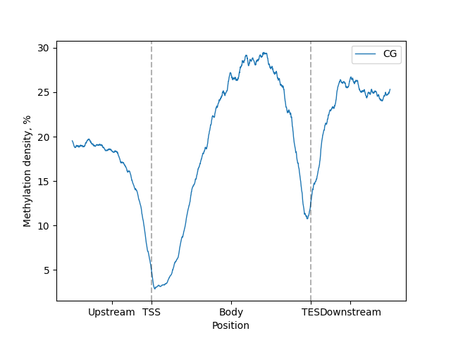
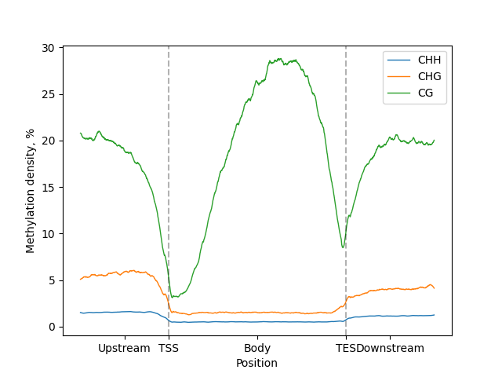
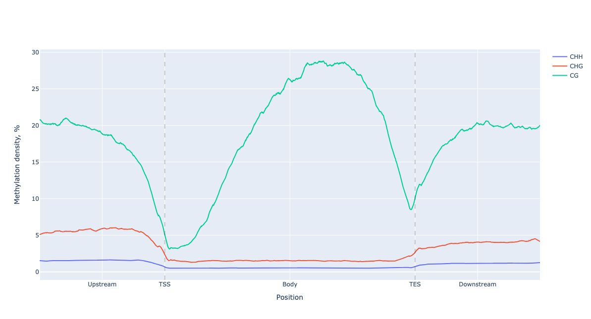
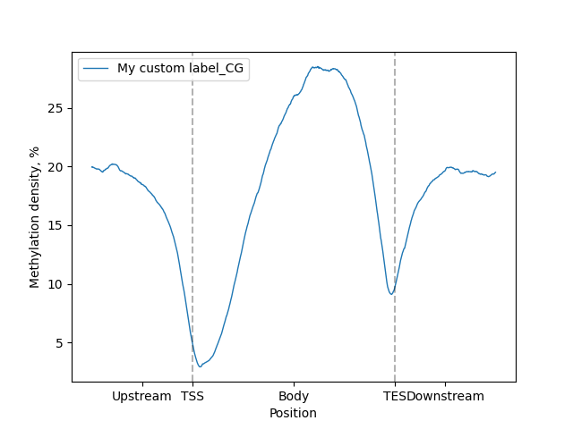
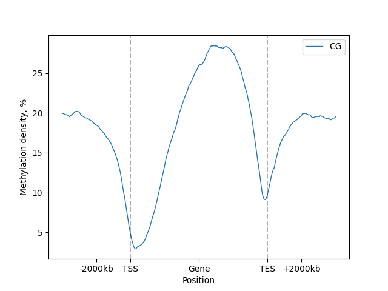
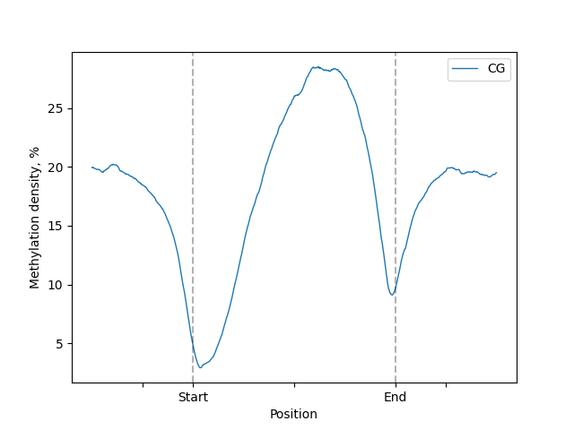
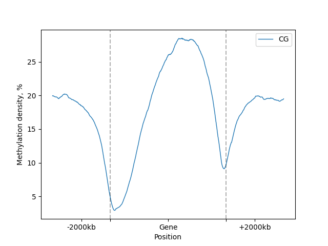

# Lineplot

This tutorial will explain you how to calculate, visualize and configure line-plots.

## Single metagene

### Initialization

```python
from bismarkplot import *

# Firstly, we need to read the regions annotation (e.g. reference genome .gff)
genome = Genome.from_gff("path/to/genome.gff")
# Next we need to filter regions of interest from the genome
genes = genome.gene_body(min_length=0, flank_length=2000)

# Now we need to calculate metagene data (e.g. from Bismark output)
metagene = bismarkplot.Metagene.from_bismark(
    file="path/to/CX_report.txt",
    genome=genes,  # filtered regions
    up_windows=500,
    body_windows=1000,
    down_windows=500
)

# Our metagene contains all methylation contexts and both strands, so we need to filter it 
# (OPTIONAL for line-plot)
filtered = metagene.filter(context="CG", strand="+")

# LinePlot now can be created
lp = filtered.line_plot()
```

### Basic usage

The easiest way to get the plot is to call `.draw_mpl()` or `.draw_plotly()` methods to get matplotlib and Plotly
versions of plots respectively

```python
figure = lp.draw_mpl()
figure.show()
```



Or for Plotly version

```python
figure = lp.draw_mpl()
figure.show()
```

#### No Metagene filtering

If metagene was not filtered by context, line-plot for all contexts on the same figure will be created

```python
lp = metagene.line_plot()  # Metagene from previous example

figure = lp.draw_mpl()
figure.show()
```



And for plotly version

```python
figure = lp.draw_mpl()
figure.show()
```




### Advanced configuration

Examples for matplotlib version of plots will be shown, but Plotly version is identical.

For all examples we use [metagene filtered by CG context](#initialization).

#### `label` parameter

Custom label can be set for line-plot using `label` parameter:

```python
lp.draw_mpl(label="My custom label")
```



#### `minor_labels` parameter

Labels for upstream, body and downstream regions can be changed to custom, but **exactly 3** need to be provided. 

Set ``[]`` to disable.


```python
lp.draw_mpl(minor_labels=["-2000kb", "Gene", "+2000kb"])
```



```python
lp.draw_mpl(minor_labels=[])
```


#### `major_labels` parameter

Labels for body region start and end (e.g. TSS, TES) can be changed to custom, but **exactly 2** need to be provided. 

Set ``[]`` to disable.


```python
lp.draw_mpl(major_labels=["Start", "End"], minor_labels=[])
```



```python
lp.draw_mpl(major_labels=[], minor_labels=["-2000kb", "Gene", "+2000kb"])
```

